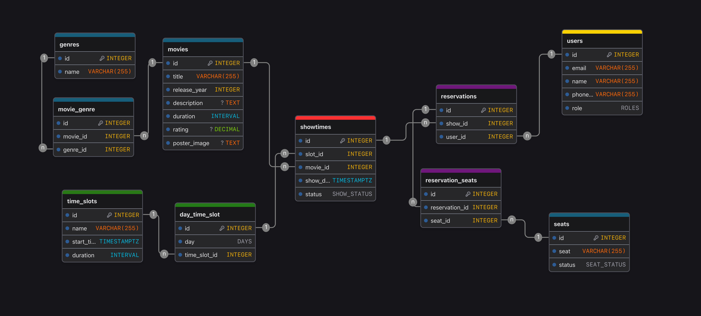

# Infinite Cineplex Backend

[](https://www.oracle.com/java/)
[](https://spring.io/projects/spring-boot)
[](https://www.postgresql.org/)
[](https://www.docker.com/)
[](LICENSE)

A comprehensive cinema booking system backend built with Spring Boot that enables movie theater management, show scheduling, seat reservations, and user authentication with JWT-based security.

💡 **Project Idea**: [https://roadmap.sh/projects/movie-reservation-system](https://roadmap.sh/projects/movie-reservation-system)

## 🚀 Live API

The API is live and accessible at:

**Base URL**: `https://infinite-cineplex-backend-production.up.railway.app`

**Health Check**: [https://infinite-cineplex-backend-production.up.railway.app/api/health](https://infinite-cineplex-backend-production.up.railway.app/api/health)

Try it out:

```bash
curl https://infinite-cineplex-backend-production.up.railway.app/api/health
```

## 🎯 What This Project Does

Infinite Cineplex Backend is a RESTful API service that provides complete functionality for managing a modern cinema complex. It handles everything from movie catalog management to seat reservations, with secure user authentication and role-based access control.

## ✨ Key Features

### 🎬 Movie Management

- Create, read, update, and delete movies with detailed information (title, description, duration, rating, poster images)
- Genre classification with many-to-many relationships
- Movie catalog with release year tracking

### 🎫 Show Time & Scheduling

- Flexible time slot management for different show times
- Day-based scheduling system
- Show status tracking (scheduled, ongoing, completed, cancelled)
- Unique show time validation per movie, date, and time slot

### 💺 Seat Reservation System

- Real-time seat availability tracking
- Prevents double-booking of seats for the same show
- Seat status management (Active, Inactive, Damaged)
- User-specific reservation tracking

### 🔐 Authentication & Security

- JWT-based stateless authentication (access tokens and refresh tokens)
- Secure password hashing
- Role-based access control (USER, ADMIN)
- Protected endpoints with Spring Security
- HttpOnly cookies for refresh token storage

### 👥 User Management

- User registration with email validation
- Unique email enforcement
- User profile management
- Admin-only user listing
- Password update functionality
- Personal reservation history

## 🚀 Getting Started

### Prerequisites

- **Java 17** or higher
- **PostgreSQL** database
- **Gradle** (wrapper included)
- **Docker** (optional, for containerized deployment)

### Installation

1. **Clone the repository**

   ```bash
   git clone <repository-url>
   cd infinite-cineplex-backend
   ```

2. **Set up environment variables**

   Create a `.env` file or set the following environment variables:

   ```bash
   DATABASE_URL=jdbc:postgresql://localhost:5432/infinite_cineplex_db
   DATABASE_USER=your_db_username
   DATABASE_PASSWORD=your_db_password
   JWT_SECRET=your_jwt_secret_key_here
   ACCESS_TOKEN_EXPIRATION=3600        # in seconds (1 hour)
   REFRESH_TOKEN_EXPIRATION=604800     # in seconds (7 days)
   ```

3. **Set up the database**

   Create a PostgreSQL database:

   ```sql
   CREATE DATABASE infinite_cineplex_db;
   ```

4. **Build the project**

   ```bash
   ./gradlew build
   ```

5. **Run the application**

   ```bash
   ./gradlew bootRun
   ```

   The server will start at `http://localhost:8000`

### Docker Deployment

Build and run using Docker:

```bash
# Build the Docker image
docker build -t infinite-cineplex-backend .

# Run the container
docker run -p 8000:8000 \
  -e DATABASE_URL=jdbc:postgresql://host.docker.internal:5432/infinite_cineplex_db \
  -e DATABASE_USER=your_db_username \
  -e DATABASE_PASSWORD=your_db_password \
  -e JWT_SECRET=your_jwt_secret_key_here \
  -e ACCESS_TOKEN_EXPIRATION=access_token_expiration_time \
  -e REFRESH_TOKEN_EXPIRATION=refresh_token_expiration_time \
  infinite-cineplex-backend
```

## 📖 API Usage Examples

You can test these examples using either the local server (`http://localhost:8000`) or the live API (`https://infinite-cineplex-backend-production.up.railway.app`).

### Authentication

**Sign Up**

```bash
curl -X POST https://infinite-cineplex-backend-production.up.railway.app/api/auth/signup \
  -H "Content-Type: application/json" \
  -d '{
    "email": "user@example.com",
    "name": "John Doe",
    "phoneNumber": "+1234567890",
    "password": "securePassword123"
  }'
```

**Login**

```bash
curl -X POST https://infinite-cineplex-backend-production.up.railway.app/api/auth/login \
  -H "Content-Type: application/json" \
  -d '{
    "email": "user@example.com",
    "password": "securePassword123"
  }'
```

Response includes an access token:

```json
{
  "accessToken": "eyJhbGciOiJIUzI1NiIs..."
}
```

### Movies

**Create a Movie** (Admin only)

```bash
curl -X POST https://infinite-cineplex-backend-production.up.railway.app/api/movies \
  -H "Content-Type: application/json" \
  -H "Authorization: Bearer YOUR_ACCESS_TOKEN" \
  -d '{
    "title": "The Matrix",
    "releaseYear": 1999,
    "description": "A computer hacker learns about the true nature of reality",
    "duration": "PT2H16M",
    "rating": 8.7,
    "posterImage": "https://example.com/matrix-poster.jpg",
    "genreIds": [1, 2, 3]
  }'
```

**Get All Movies**

```bash
curl https://infinite-cineplex-backend-production.up.railway.app/api/movies
```

### Show Times

**Create a Show Time** (Admin only)

```bash
curl -X POST https://infinite-cineplex-backend-production.up.railway.app/api/show-times \
  -H "Content-Type: application/json" \
  -H "Authorization: Bearer YOUR_ACCESS_TOKEN" \
  -d '{
    "movieId": 1,
    "slotId": 2,
    "showDate": "2025-10-25",
    "status": "SCHEDULED"
  }'
```

**Get All Show Times**

```bash
curl https://infinite-cineplex-backend-production.up.railway.app/api/show-times
```

### Reservations

**Create a Reservation**

```bash
curl -X POST https://infinite-cineplex-backend-production.up.railway.app/api/reservations \
  -H "Content-Type: application/json" \
  -H "Authorization: Bearer YOUR_ACCESS_TOKEN" \
  -d '{
    "showId": 1,
    "userId": 1,
    "seatIds": [5, 6, 7]
  }'
```

**Get My Reservations**

```bash
curl https://infinite-cineplex-backend-production.up.railway.app/api/reservations/my-reservations \
  -H "Authorization: Bearer YOUR_ACCESS_TOKEN"
```

### Health Check

```bash
curl https://infinite-cineplex-backend-production.up.railway.app/api/health
```

## 🗄️ Database Schema

The application uses PostgreSQL with Flyway migrations for version control. The database includes the following main entities:

- **Movies** - Movie information and metadata
- **Genres** - Movie genres with many-to-many relationship
- **Time Slots** - Available show time slots
- **Day Time Slots** - Daily schedule mapping
- **Show Times** - Scheduled movie shows
- **Users** - User accounts with authentication
- **Seats** - Theater seats with status tracking
- **Reservations** - Seat bookings with user and show time references



For detailed schema information, see [Database Documentation](infinite_cineplex_db.md)

## 🛠️ Technology Stack

- **Framework**: Spring Boot 3.5.6
- **Language**: Java 17
- **Database**: PostgreSQL
- **Migration**: Flyway
- **Security**: Spring Security with JWT
- **Authentication**: JSON Web Tokens (jjwt 0.13.0)
- **ORM**: Spring Data JPA / Hibernate
- **Validation**: Jakarta Validation
- **Build Tool**: Gradle
- **Utilities**: Lombok

## 📁 Project Structure

```
src/main/java/me/riazulislam/infinitecineplexbackend/
├── configurations/     # Security and JWT configuration
├── controllers/        # REST API endpoints
├── dtos/              # Data Transfer Objects
├── mappers/           # Entity-DTO converters
├── models/            # JPA Entity models
├── repositories/      # Data access layer
├── services/          # Business logic layer
└── utils/             # Helper utilities

src/main/resources/
├── application.properties       # Application configuration
└── db/migration/               # Flyway migration scripts
```

## 🔒 Security

The application implements comprehensive security features:

- **JWT Authentication**: Stateless authentication using access and refresh tokens
- **Password Encryption**: BCrypt hashing for secure password storage
- **Role-Based Access**: USER and ADMIN roles with endpoint-level authorization
- **Secure Cookies**: HttpOnly cookies for refresh token storage
- **CORS Configuration**: Configurable cross-origin resource sharing
- **SQL Injection Protection**: Parameterized queries via JPA

## 🧪 Testing

Run the test suite:

```bash
./gradlew test
```

View test reports:

```bash
open build/reports/tests/test/index.html
```

## 📚 API Documentation

The API follows RESTful principles with the following main endpoints:

| Endpoint                                | Description          | Authentication |
| --------------------------------------- | -------------------- | -------------- |
| `POST /api/auth/signup`                 | User registration    | Public         |
| `POST /api/auth/login`                  | User login           | Public         |
| `POST /api/auth/refresh`                | Refresh access token | Refresh Token  |
| `POST /api/auth/logout`                 | User logout          | Required       |
| `GET /api/movies`                       | List all movies      | Public         |
| `POST /api/movies`                      | Create movie         | Admin only     |
| `GET /api/show-times`                   | List all show times  | Public         |
| `POST /api/show-times`                  | Create show time     | Admin only     |
| `GET /api/reservations/my-reservations` | User's reservations  | Required       |
| `POST /api/reservations`                | Create reservation   | Required       |
| `GET /api/users`                        | List all users       | Admin only     |
| `GET /api/health`                       | Health check         | Public         |

## 🤝 Contributing

Contributions are welcome! Please feel free to submit a Pull Request. For major changes, please open an issue first to discuss what you would like to change.

## 📄 License

This project is licensed under the MIT License - see the [LICENSE](LICENSE) file for details.

## 💬 Support

For questions, issues, or support:

- Open an issue in the GitHub repository
- Check existing documentation in the `docs/` folder
- Review the database schema documentation

## 🔮 Future Enhancements

Potential features for future releases:

- Payment integration
- Email notifications for bookings
- Movie reviews and ratings system
- Loyalty program
- Multi-theater support
- Advanced reporting and analytics
- Mobile app integration

---

**Note**: Make sure to change the default JWT secret and use strong passwords in production environments.
