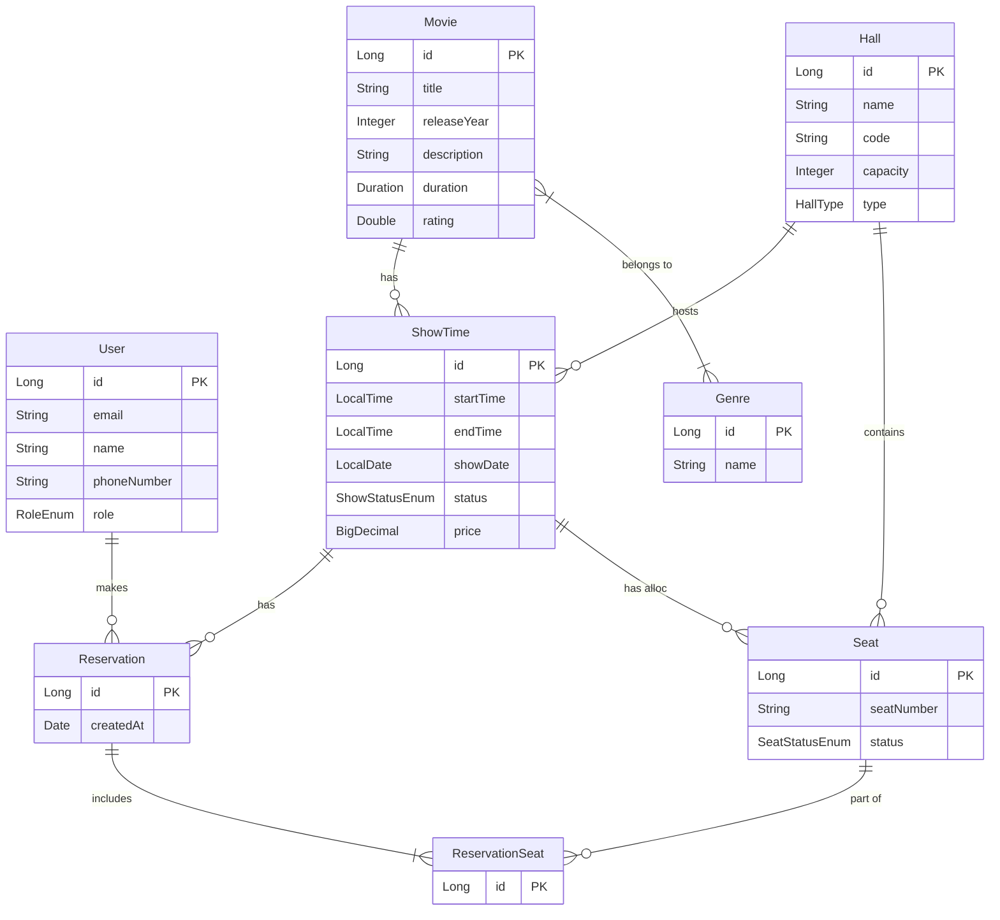

# Building Book Your Show: A Robust Cinema Booking Backend

Creating a seamless movie ticket booking experience requires a solid backend foundation. In this post, I'll walk you through **Book Your Show Backend**, a comprehensive RESTful API service designed to manage a modern cinema complex. From movie catalogs to real-time seat reservations, this system handles it all with secure authentication and robust data integrity.

## 🚀 The Tech Stack

To ensure scalability, reliability, and maintainability, I chose a modern Java stack:

-   **Core Framework**: [Spring Boot 3.5.6](https://spring.io/projects/spring-boot) for rapid development and production-ready features.
-   **Language**: **Java 17**, leveraging the latest LTS features.
-   **Database**: **PostgreSQL**, a powerful open-source relational database.
-   **ORM**: **Spring Data JPA / Hibernate** for efficient database interactions.
-   **Security**: **Spring Security** with **JWT** (JSON Web Tokens) for stateless authentication.
-   **Migration**: **Flyway** for version-controlled database schema changes.
-   **Deployment**: **Docker** for containerization and easy deployment on platforms like Railway.

## 🏗️ Architecture & Design

The project follows a clean, layered architecture to separate concerns and improve testability:

1.  **Controllers**: Handle HTTP requests and define REST endpoints.
2.  **Services**: Contain the business logic (e.g., calculating ticket prices, validating show times).
3.  **Repositories**: Interact with the database using Spring Data JPA.
4.  **DTOs (Data Transfer Objects)**: Ensure strict contracts for API requests and responses, decoupling the internal database model from the external API.

### Database Schema

A well-designed schema is crucial for a booking system. Key entities include:

-   **Movies & Genres**: A many-to-many relationship allowing movies to have multiple genres.
-   **ShowTimes**: Links specific movies to time slots and dates.
-   **Seats & Reservations**: The core of the booking system. `ReservationSeats` links bookings to specific seats, ensuring no double bookings occurs.



## 🔐 Security & Authentication

Security is paramount. The application implements a robust JWT-based authentication system:

-   **Stateless**: No server-side session storage, making horizontal scaling easier.
-   **Dual Tokens**: Uses **Access Tokens** (short-lived) for requests and **Refresh Tokens** (long-lived, stored in HttpOnly cookies) to maintain user sessions securely.
-   **Role-Based Access Control (RBAC)**: secure endpoints ensure that only `ADMIN` users can create movies or schedule shows, while `USER` roles can browse and book tickets.

```java
// Example: Securing endpoints
@Configuration
@EnableWebSecurity
public class SecurityConfig {
    // ... configuration to permit public access to /api/movies
    // but require authentication for /api/reservations
}
```

## ✨ Key Features

### 1. Smart Show Scheduling
The system prevents scheduling conflicts. It validates that a specific movie isn't scheduled twice in the same hall at the same time, ensuring a logical flow of showtimes logic.

### 2. Concurrency-Safe Seat Reservation
Booking tickets involves a race condition risks where two users might try to book the same seat. Using database transactions and constraints, Book Your Show ensures that once a seat is reserved, it cannot be double-booked.

### 3. Comprehensive Movie Management
Admins can manage the entire catalogue:
-   Add movies with rich metadata (posters, ratings, duration).
-   Classify movies by genres.
-   Track release years and descriptions.

## 🛠️ API First Approach

The API is designed to be intuitive and developer-friendly. Here are a few examples:

-   **Get Movies**: `GET /api/movies`
-   **Get Movie by ID**: `GET /api/movies/{id}`
-   **Get Showtimes**: `GET /api/showtimes`
-   **Get Showtimes by Movie**: `GET /api/showtimes/{id}`
-   **Get Seats for the show**: `GET /api/showtimes/{id}/seats`
-   **Get Reservations**: `GET /api/reservations/my-reservations`
-   **Book Seats**: `POST /api/reservations`

All endpoints return standardized JSON responses with proper HTTP status codes.

## 🔮 Future Roadmap

This backend is just the beginning. Future enhancements include:

-   **Payment Gateway Integration**: To process real payments (or maybe not).
-   **Email Notifications**: Sending booking confirmations.
-   **Analytics Dashboard**: For admins to view sales trends.

---

**Book Your Show Backend** demonstrates how modern Java technologies can be combined to build a production-grade application. Check out the [Website](https://bookyourshow.pradeepswork.space/) to dive deeper into and try it out!


