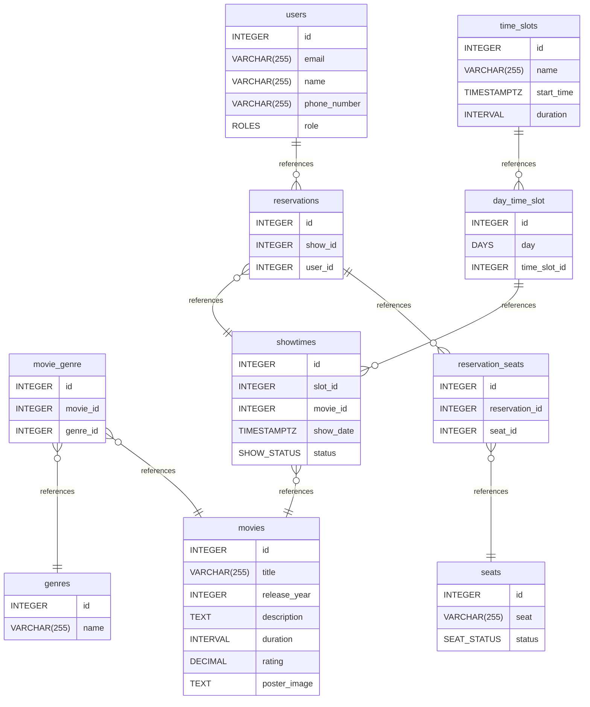

# Infinite Cineplex documentation
## Summary

- [Introduction](#introduction)
- [Database Type](#database-type)
- [Table Structure](#table-structure)
	- [time_slots](#time_slots)
	- [movies](#movies)
	- [genres](#genres)
	- [movie_genre](#movie_genre)
	- [users](#users)
	- [showtimes](#showtimes)
	- [reservations](#reservations)
	- [day_time_slot](#day_time_slot)
	- [reservation_seats](#reservation_seats)
	- [seats](#seats)
- [Relationships](#relationships)
- [Database Diagram](#database-diagram)

## Introduction

## Database type

- **Database system:** PostgreSQL
## Table structure

### time_slots

| Name        | Type          | Settings                      | References                    | Note                           |
|-------------|---------------|-------------------------------|-------------------------------|--------------------------------|
| **id** | INTEGER | 🔑 PK, not null, unique, autoincrement | fk_shows_id_show_time | |
| **name** | VARCHAR(255) | not null |  | |
| **start_time** | TIMESTAMPTZ | not null |  | |
| **duration** | INTERVAL | not null |  | | 

### movies

| Name        | Type          | Settings                      | References                    | Note                           |
|-------------|---------------|-------------------------------|-------------------------------|--------------------------------|
| **id** | INTEGER | 🔑 PK, not null, unique, autoincrement |  | |
| **title** | VARCHAR(255) | not null |  | |
| **release_year** | INTEGER | not null |  | |
| **description** | TEXT | null |  | |
| **duration** | INTERVAL | not null |  | |
| **rating** | DECIMAL | null |  | |
| **poster_image** | TEXT | null |  | | 

### genres

| Name        | Type          | Settings                      | References                    | Note                           |
|-------------|---------------|-------------------------------|-------------------------------|--------------------------------|
| **id** | INTEGER | 🔑 PK, not null, unique, autoincrement |  | |
| **name** | VARCHAR(255) | not null |  | | 

### movie_genre

| Name        | Type          | Settings                      | References                    | Note                           |
|-------------|---------------|-------------------------------|-------------------------------|--------------------------------|
| **id** | INTEGER | 🔑 PK, not null, unique, autoincrement |  | |
| **movie_id** | INTEGER | not null | fk_movie_genre_movie_id_movies | |
| **genre_id** | INTEGER | not null | fk_movie_genre_genre_id_genres | | 

### users

| Name        | Type          | Settings                      | References                    | Note                           |
|-------------|---------------|-------------------------------|-------------------------------|--------------------------------|
| **id** | INTEGER | 🔑 PK, not null, unique, autoincrement | fk_users_id_show_bookings | |
| **email** | VARCHAR(255) | not null |  | |
| **name** | VARCHAR(255) | not null |  | |
| **phone_number** | VARCHAR(255) | not null |  | |
| **role** | ROLES | not null, default: USER |  | | 

### showtimes

| Name        | Type          | Settings                      | References                    | Note                           |
|-------------|---------------|-------------------------------|-------------------------------|--------------------------------|
| **id** | INTEGER | 🔑 PK, not null, unique, autoincrement |  | |
| **slot_id** | INTEGER | not null |  | |
| **movie_id** | INTEGER | not null | fk_shows_list_show_movie_movies | |
| **show_date** | TIMESTAMPTZ | not null |  | |
| **status** | SHOW_STATUS | not null, default: scheduled |  | | 

### reservations

| Name        | Type          | Settings                      | References                    | Note                           |
|-------------|---------------|-------------------------------|-------------------------------|--------------------------------|
| **id** | INTEGER | 🔑 PK, not null, unique, autoincrement | fk_reservations_id_reservation_seats | |
| **show_id** | INTEGER | not null | fk_show_bookings_show_id_shows_list | |
| **user_id** | INTEGER | not null |  | | 

### day_time_slot

| Name        | Type          | Settings                      | References                    | Note                           |
|-------------|---------------|-------------------------------|-------------------------------|--------------------------------|
| **id** | INTEGER | 🔑 PK, not null, unique, autoincrement | fk_show_time_id_shows_list | |
| **day** | DAYS | not null |  | |
| **time_slot_id** | INTEGER | not null |  | | 

### reservation_seats

| Name        | Type          | Settings                      | References                    | Note                           |
|-------------|---------------|-------------------------------|-------------------------------|--------------------------------|
| **id** | INTEGER | 🔑 PK, not null, unique, autoincrement |  | |
| **reservation_id** | INTEGER | not null |  | |
| **seat_id** | INTEGER | not null, unique | fk_reservation_seats_seat_id_seats | | 

### seats

| Name        | Type          | Settings                      | References                    | Note                           |
|-------------|---------------|-------------------------------|-------------------------------|--------------------------------|
| **id** | INTEGER | 🔑 PK, not null, unique, autoincrement |  | |
| **seat** | VARCHAR(255) | not null |  | |
| **status** | SEAT_STATUS | not null, default: Active |  | | 

## Relationships

- **movie_genre to genres**: many_to_one
- **movie_genre to movies**: many_to_one
- **showtimes to movies**: many_to_one
- **reservations to showtimes**: many_to_one
- **users to reservations**: one_to_many
- **time_slots to day_time_slot**: one_to_many
- **day_time_slot to showtimes**: one_to_many
- **reservations to reservation_seats**: one_to_many
- **reservation_seats to seats**: many_to_one

## Database Diagram

